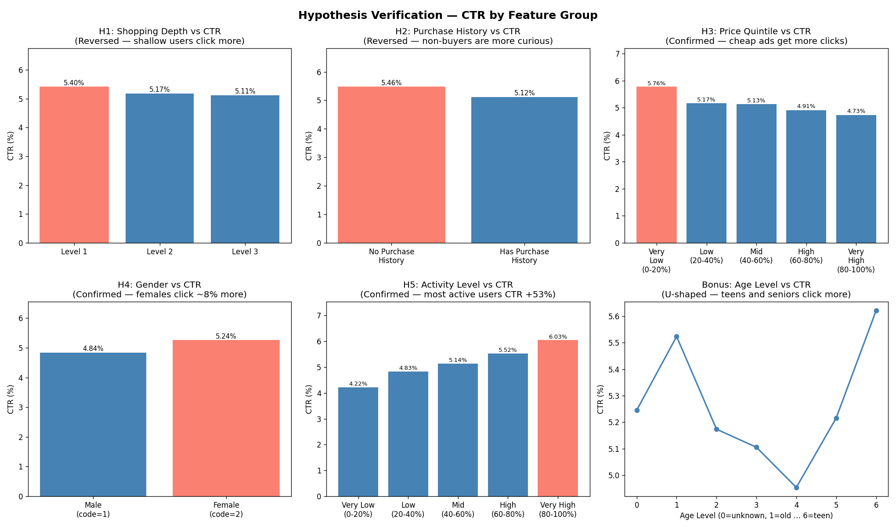

# Taobao Ad CTR Prediction

Using Alibaba's [Ali Display Ad Click dataset](https://tianchi.aliyun.com/dataset/56) to predict ad click-through rates. The dataset is large — 723 million rows of user behavior logs and 26.6 million ad impressions across 8 days in May 2017.

## Data

Four tables, none tracked in the repo (drop them in the project root to run):

- `raw_sample.csv` (1.1 GB) — ad impressions with click labels
- `behavior_log.csv` (23 GB) — historical user behavior
- `user_profile.csv` (23 MB) — user demographics
- `ad_feature.csv` (30 MB) — ad attributes

## Findings so far

**Overall CTR is 5.14%.** The behavior log had 7.1% exact duplicate rows from logging artifacts — removed before anything else. The 23 GB file was chunked and converted to parquet (down to 4.9 GB, ~5× compression).

I tested five hypotheses about what drives CTR. Two came out backwards in ways worth thinking about:

- **Shopping depth → more clicks? No.** Shallow shoppers (level 1) click more than heavy ones (5.40% vs 5.11%). Heavy shoppers browse with intent — they search for what they want rather than clicking display ads.
- **Purchase history → more clicks? Also no.** Non-buyers click more (5.46% vs 5.12%). They're still in exploration mode and seem more receptive to ads.

The ones that held:
- Cheaper ads get more clicks — CTR drops from 5.76% (cheapest quintile) to 4.73% (priciest), monotonically
- Female users click slightly more — 5.24% vs 4.84%
- **Activity level is the strongest signal** — top-20% most active users click at 6.03%, bottom-20% at 4.22%



## Structure

```
src/
  01_clean_ad_feature.py
  02_clean_user_profile.py
  03_clean_raw_sample.py
  04_clean_behavior_log.py    # chunked processing for the 23 GB file
  05_aggregate_behavior.py
  06_hypothesis_verification.py
outputs/
  plots/                      # visualizations
  stats/                      # JSON summaries per script
```

## Running

```bash
pip install -r requirements.txt

python src/01_clean_ad_feature.py
python src/02_clean_user_profile.py
python src/03_clean_raw_sample.py
python src/04_clean_behavior_log.py   # ~3 min, outputs 362 parquet chunks
python src/05_aggregate_behavior.py
python src/06_hypothesis_verification.py
```

Script 04 reads `behavior_log.csv` in 2M-row chunks — the machine this was developed on only has 3.8 GB RAM.

## What's next

Building a sparse user-ad interaction matrix, running truncated SVD to extract user and ad embeddings, then training a CTR model. Baseline AUC to beat is 0.622.
